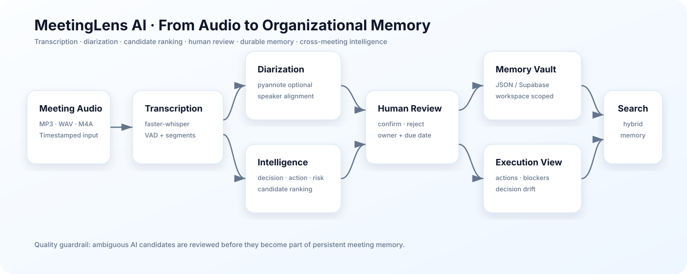

<div align="center">

# MeetingLens AI

### Meeting intelligence that turns audio into decisions, actions & organizational memory

**faster-whisper · optional diarization · decision/action ranking · human review · cross-meeting memory**


</div>

**MeetingLens AI** converts meeting audio into timestamped evidence, speaker-aware transcripts, decisions, action items, risks and cross-meeting organizational memory.

> From conversation to decisions that move.

## Architecture



The system deliberately separates transcription, diarization, intelligence extraction, human review, persistence and cross-meeting analysis. Ambiguous AI candidates are not silently promoted into durable memory.

## Core capabilities

- English-first meeting-audio transcription with VAD and timestamps;
- optional pyannote speaker diarization;
- speaker-label review and correction;
- sentiment and participation analytics;
- decision, action and risk extraction;
- AMI-trained Decision/Action candidate ranking;
- human-in-the-loop review queue;
- owner and due-date extraction;
- cross-meeting hybrid retrieval;
- recurring blocker detection;
- Decision Drift analysis;
- execution tracking and action lifecycle management;
- JSON or Supabase-backed Memory Vault;
- optional OIDC authentication;
- deployment/runtime diagnostics.

## Product flow

```text
meeting audio
  → faster-whisper transcription
  → optional pyannote diarization
  → timestamp / speaker alignment
  → sentiment + deterministic extraction
  → Decision / Action candidate ranking
  → human review
  → Meeting JSON
  → Memory Vault
  → search · drift · blockers · execution tracking
```

## AI review by design

AMI-trained rankers surface likely decision and action evidence. Reviewers can:

- confirm a Decision candidate;
- confirm an Action candidate;
- reject a candidate;
- correct owner and due date;
- persist reviewed meeting memory.

This keeps the learned ranking layer **human-in-the-loop** rather than treating uncertain predictions as facts.

## AMI evaluation

Current validated held-out ranking results:

| Event | Hit@5 | Hit@10 | Hit@20 |
|---|---:|---:|---:|
| Decision | 68.0% | 80.0% | 88.0% |
| Action | 77.8% | — | 94.4% |

`Risk` remains rule/hybrid-oriented because the learned transcript-only detector did not justify replacing the higher-precision deterministic rules.

## Cross-meeting memory

Memory Intelligence supports:

- fingerprint-based deduplication;
- hybrid word + character TF-IDF retrieval;
- source meeting and timestamp evidence;
- recurring blocker clustering;
- interpretable Decision Drift;
- missing owner/deadline flags;
- action states: `Open`, `In progress`, `Blocked`, `Done`;
- persistent owner/deadline corrections;
- topic-frequency analysis.

### Storage options

1. **Runtime JSON** — zero external configuration.
2. **Supabase** — durable storage across restarts/redeploys.

Hosted records are scoped by `workspace_id`.

## Run locally

```bash
python -m venv .venv
# Windows: .venv\Scripts\activate
# macOS/Linux: source .venv/bin/activate
pip install -r requirements.txt
streamlit run app.py
```

Optional diarization:

```bash
pip install -r requirements-diarization.txt
```

Configure `HF_TOKEN` only when diarization is enabled.

## Main technology stack

`Python` · `Streamlit` · `faster-whisper` · `pyannote.audio` · `scikit-learn` · `Pandas` · `Plotly` · `Supabase` · `OIDC` · `GitHub Actions`

## Important modules

```text
app.py                          executive workspace
meetinglens_pipeline.py         transcription + intelligence pipeline
meetinglens_candidate_ranker.py Decision/Action ranker runtime
meetinglens_diarization.py      diarization + alignment
meetinglens_intelligence.py     retrieval, drift, blockers, execution
meetinglens_memory_store.py     JSON + Supabase memory
meetinglens_review.py           human review operations
training/                       AMI training and evaluation
benchmarks/                     real-audio benchmark harness
```

## Limitations

- transcription is English-first;
- diarization requires optional dependencies and Hugging Face access;
- runtime JSON is not durable across instance recreation;
- Decision Drift is interpretable/heuristic rather than a dedicated contradiction model;
- organization-grade multi-user authorization requires an identity-to-workspace membership layer beyond the current workspace boundary.

## Author

Developed and maintained by **Chaima Menouar**.
