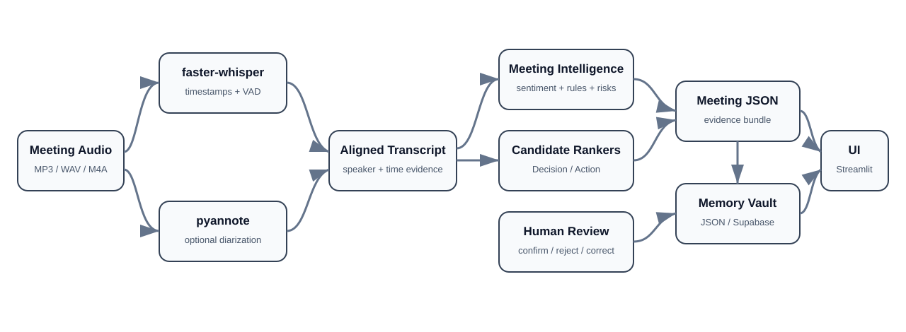

# MeetingLens AI

**MeetingLens AI** turns meeting audio into timestamped evidence, speaker-aware transcripts, decisions, action items, risks, and cross-meeting organizational memory.

> From conversation to decisions that move.

## Architecture



The system keeps transcription, diarization, intelligence extraction, human review, persistence, and cross-meeting analysis separate. Ambiguous AI candidates are not silently promoted into final meeting memory; they can be reviewed and corrected before persistence.

## Main capabilities

- meeting-audio upload and English-first transcription;
- timestamped transcript segments with VAD;
- optional pyannote speaker diarization;
- speaker-label review and correction;
- sentiment and participation analytics;
- high-precision decision, action, and risk extraction;
- AMI-trained Decision/Action candidate ranking;
- human-in-the-loop AI review queue;
- owner and due-date extraction;
- cross-meeting hybrid retrieval;
- recurring blocker detection;
- Decision Drift analysis;
- execution tracking and action lifecycle management;
- runtime JSON or Supabase-backed Memory Vault;
- optional OIDC authentication;
- deployment/runtime diagnostics.

## Product flow

```text
meeting audio
  -> faster-whisper transcription
  -> optional pyannote diarization
  -> timestamp/speaker alignment
  -> sentiment + deterministic extraction
  -> Decision/Action candidate ranking
  -> human review
  -> Meeting JSON
  -> Memory Vault
  -> search, drift, blockers and execution tracking
```

## Real audio analysis

The **Analyze Audio** workflow supports MP3, WAV, M4A, MP4, WEBM, and MPEG uploads. The Streamlit deployment uses a 100 MB upload limit.

The pipeline includes:

- cached `faster-whisper` model instances;
- VAD and timestamps;
- segment sentiment;
- decision/action/risk extraction;
- optional diarization;
- candidate ranking;
- save-to-memory and JSON export.

## Speaker diarization

Optional diarization is based on **pyannote Community-1**.

```bash
pip install -r requirements-diarization.txt
```

Configure `HF_TOKEN` in the environment or Streamlit Secrets. If diarization is unavailable, transcription remains usable and MeetingLens routes uncertain speaker labels to **Speaker Review** rather than treating them as ground truth.

Quality diagnostics record detected speakers, speaker turns, direct-overlap coverage, fallback assignments, and a `high / medium / review` status.

## AI Review Queue

AMI-trained rankers surface likely Decision and Action evidence. The review workflow supports:

- confirm Decision candidate;
- confirm Action candidate;
- reject candidate;
- persistent review history;
- owner initialization from the detected speaker;
- save reviewed meeting back to the Memory Vault.

This keeps the learned ranking layer human-in-the-loop.

## Cross-meeting memory

Memory Intelligence supports:

- MeetingLens JSON import/export;
- fingerprint-based deduplication;
- hybrid word + character TF-IDF retrieval;
- source meeting and timestamp evidence;
- recurring blocker clustering;
- interpretable Decision Drift;
- missing owner/deadline flags;
- action states: `Open`, `In progress`, `Blocked`, `Done`;
- persistent owner/deadline corrections;
- topic-frequency analysis.

### Storage backends

1. **Runtime JSON fallback** — zero external configuration; persists while the Streamlit runtime remains alive.
2. **Supabase** — durable hosted storage across restarts/redeploys.

Hosted records are scoped by `workspace_id`, including destructive operations such as clearing a workspace's Memory Vault.

## Optional authentication

MeetingLens supports Streamlit-native OIDC authentication while remaining usable without authentication configuration.

- without an `[auth]` section, the current public/single-user flow is preserved;
- with OIDC configured, all pages require login;
- sign-out appears only in authenticated mode;
- a CI guard checks that pages do not silently omit the auth gate.

## AMI training and evaluation

The repository includes a reproducible training track based on the **AMI Meeting Corpus** manual annotations:

```bash
pip install -r requirements-training.txt
python -m training.run_ami_training
```

The production formulation ranks useful candidate segments within each meeting instead of treating sparse decision evidence as a simple global utterance-classification problem.

Current validated held-out AMI ranking results:

| Event | Hit@5 | Hit@10 | Hit@20 |
|---|---:|---:|---:|
| Decision | 68.0% | 80.0% | 88.0% |
| Action | 77.8% | — | 94.4% |

`Risk` remains rule/hybrid-oriented because the learned transcript-only detector did not justify replacing the higher-precision deterministic rules.

## Model promotion

GitHub Actions trains and evaluates candidate rankers. A quality gate must pass before promoted artifacts are placed under:

```text
artifacts/meeting_candidate_rankers/
```

If promoted artifacts are missing or fail to load, deterministic extraction remains available.

## Important files

```text
app.py                              executive workspace
meetinglens_auth.py                 optional OIDC gate
meetinglens_pipeline.py             transcription + intelligence pipeline
meetinglens_candidate_ranker.py     Decision/Action ranker runtime
meetinglens_diarization.py          diarization + timestamp alignment
meetinglens_diagnostics.py          deployment/runtime readiness
meetinglens_intelligence.py         retrieval, drift, blockers, execution
meetinglens_memory_store.py         JSON + Supabase memory backends
meetinglens_review.py               candidate review operations
supabase_schema.sql                 workspace-aware durable storage
pages/                              Streamlit workflows
training/                           AMI training and evaluation
benchmarks/                         real-audio benchmark harness
```

## Run locally

```bash
python -m venv .venv
# Windows
.venv\Scripts\activate
pip install -r requirements.txt
streamlit run app.py
```

For diarization:

```bash
pip install -r requirements-diarization.txt
```

## Deployment

Target: **Streamlit Community Cloud**.

The standard deployment intentionally does not force the heavy pyannote runtime. Diarization can be enabled in an environment where optional dependencies and Hugging Face access are configured.

## Technology stack

- Python
- Streamlit
- faster-whisper
- pyannote.audio (optional)
- scikit-learn
- Pandas
- Plotly
- VADER Sentiment
- Supabase (optional)
- Authlib / OIDC (optional)
- GitHub Actions

## Current limitations

- transcription is English-first;
- diarization requires optional dependencies and Hugging Face access;
- runtime JSON storage is not durable across Streamlit instance recreation unless Supabase is configured;
- Decision Drift remains interpretable/heuristic rather than a dedicated contradiction model;
- true multi-user organization authorization requires an identity-to-workspace membership layer beyond the current workspace boundary.

## Author

Developed and maintained by **Chaima Menouar**.
